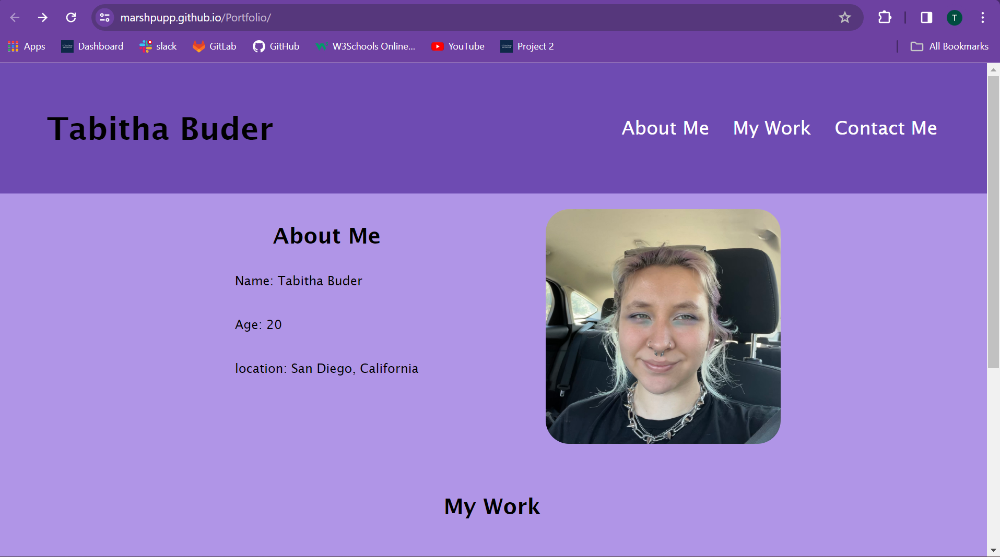
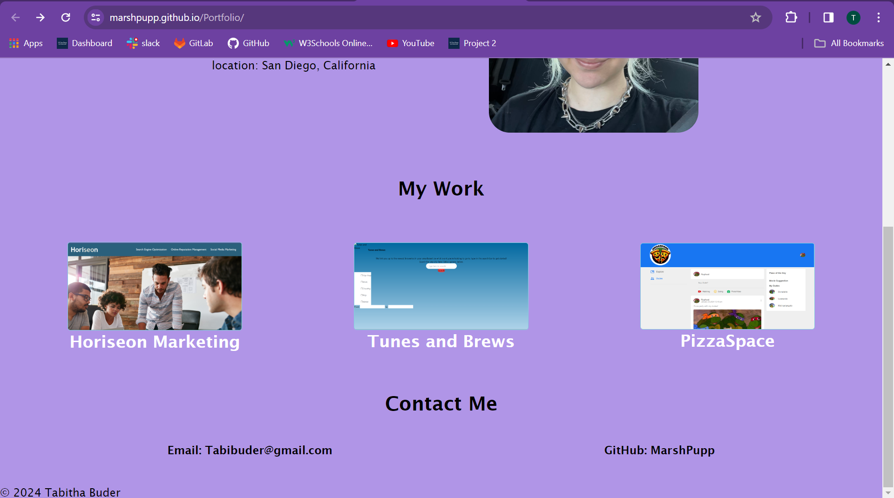

# Portfolio Website

## Description ##
Create a portfolio website to display current skills and previous projects.

## User Story ##
~~~
AS AN employer
I WANT to view a potential employee's deployed portfolio of work samples
SO THAT I can review samples of their work and assess whether they're a good candidate for an open position
~~~
## Acceptance Criteria ##
~~~
GIVEN I need to sample a potential employee's previous work
WHEN I load their portfolio
THEN I am presented with the developer's name, a recent photo or avatar, and links to sections about them, their work, and how to contact them
WHEN I click one of the links in the navigation
THEN the UI scrolls to the corresponding section
WHEN I click on the link to the section about their work
THEN the UI scrolls to a section with titled images of the developer's applications
WHEN I am presented with the developer's first application
THEN that application's image should be larger in size than the others
WHEN I click on the images of the applications
THEN I am taken to that deployed application
WHEN I resize the page or view the site on various screens and devices
THEN I am presented with a responsive layout that adapts to my viewport
~~~
## Completed Tasks ##
* Created Portfolio Website
* Created Navbar with name and links to content
* Created UI scroll system
* Created interactive thumbnails of previous work that link to the deployed site
* Created responsive UI

## Links ##
Link to repository: https://github.com/MarshPupp/Portfolio

Link to deployed site: https://marshpupp.github.io/Portfolio/
## Deployed Images ##

## Acknowledgements ##
* MDN docs were referenced (https://developer.mozilla.org/en-US/)
* W3Schools were referenced (https://www.w3schools.com/css/default.asp)
* Chat GPT for Read Me format and starter code